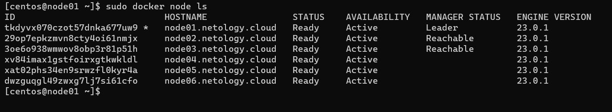
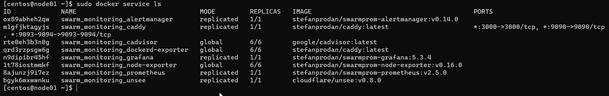

# Домашнее задание к занятию 5. «Оркестрация кластером Docker контейнеров на примере Docker Swarm»

---

## Задача 1

Дайте письменые ответы на вопросы:
>
> - В чём отличие режимов работы сервисов в Docker Swarm-кластере: replication и global?
> - Какой алгоритм выбора лидера используется в Docker Swarm-кластере?
> - Что такое Overlay Network?

### Решение 1

> - В чём отличие режимов работы сервисов в Docker Swarm-кластере: replication и global?
- В режиме global приложение или приложения запускае(ю)тся на всех нодах, а в режиме replication указывается количество реплик используемых для приложения(т.е. на какой-то ноде может не быть экземпляров приложений)

> - Какой алгоритм выбора лидера используется в Docker Swarm-кластере?
- используется алгоритм Raft
```
- Алгоритм решает проблему согласованности - чтобы все manager-ноды имели одинаковое представление о состоянии кластера
- Для отказоустойчивой работы должно быть не менее трёх manager-нод.
- Количество нод обязательно должно быть нечётным, но лучше не более 7 (рекомендация из документации Docker).
- Среди manager-нод выбирается лидер, его задача гарантировать согласованность.
- Лидер отправляет keepalive-пакеты с заданной периодичностью в пределах 150-300мс. 
Если пакеты не пришли, менеджеры начинают выборы нового лидера.
- Если кластер разбит, нечётное количество нод должно гарантировать, что кластер останется консистентным, 
т.к. факт изменения состояния считается совершенным, если его отразило большинство нод. Если разбить кластер пополам,
нечётное число гарантирует, что в какой-то части кластера будеть большинство нод.
``` 
>- Что такое Overlay Network?
- Оверлейная сеть (от англ. Overlay Network) — общий случай логической сети, создаваемой поверх другой сети. Узлы оверлейной сети могут быть связаны либо физическим соединением, либо логическим, для которого в основной сети существуют один или несколько соответствующих маршрутов из физических соединений

В случае с docker строится оверлей сеть для взаимодействия контейнеров между собой.


## Задача 2
>
> Создайте ваш первый Docker Swarm-кластер в Яндекс Облаке.
> 
> Чтобы получить зачёт, предоставьте скриншот из терминала (консоли) с выводом команды:
> ```
> docker node ls
> ```

### Решение 2
- Слегка отредактируем terraform файлы для создания ВМ
- Созданные хосты:
```
external_ip_address_node01 = "51.250.11.114"
external_ip_address_node02 = "158.160.40.116"
external_ip_address_node03 = "51.250.69.25"
external_ip_address_node04 = "158.160.37.8"
external_ip_address_node05 = "158.160.33.159"
external_ip_address_node06 = "158.160.54.133"
internal_ip_address_node01 = "192.168.101.11"
internal_ip_address_node02 = "192.168.101.12"
internal_ip_address_node03 = "192.168.101.13"
internal_ip_address_node04 = "192.168.101.14"
internal_ip_address_node05 = "192.168.101.15"
internal_ip_address_node06 = "192.168.101.16"
```
- Подключаемся к manager для отображения нод:
```
$ ssh centos@51.250.11.114
[centos@node01 ~]$ sudo docker node ls
ID                            HOSTNAME                STATUS    AVAILABILITY   MANAGER STATUS   ENGINE VERSION
tkdyvx070czot57dnka677uw9 *   node01.netology.cloud   Ready     Active         Leader           23.0.1
29op7epkzmvn8cty4oi61nmjx     node02.netology.cloud   Ready     Active         Reachable        23.0.1
3oe6o938wmwov8obp3r81p51h     node03.netology.cloud   Ready     Active         Reachable        23.0.1
xv84imax1gstfoirxgtkwkldl     node04.netology.cloud   Ready     Active                          23.0.1
xat02phs34en9srwzfl0kyr4a     node05.netology.cloud   Ready     Active                          23.0.1
dwzguqgl49zwxg7lj7si61cfo     node06.netology.cloud   Ready     Active                          23.0.1
```
Скрин терминала:
<p align="center">
  
</p>

## Задача 3
> 
> Создайте ваш первый, готовый к боевой эксплуатации кластер мониторинга, состоящий из стека микросервисов.
> 
> Чтобы получить зачёт, предоставьте скриншот из терминала (консоли), с выводом команды:
> ```
> docker service ls
> ```

### Решение 3
```
[centos@node01 ~]$ sudo docker service ls
ID             NAME                                MODE         REPLICAS   IMAGE                                          PORTS
ox89abheh2qw   swarm_monitoring_alertmanager       replicated   1/1        stefanprodan/swarmprom-alertmanager:v0.14.0
m1gfjktagyjs   swarm_monitoring_caddy              replicated   1/1        stefanprodan/caddy:latest                      *:3000->3000/tcp, *:9090->9090/tcp, *:9093-9094->9093-9094/tcp
rte0eh3b3n0g   swarm_monitoring_cadvisor           global       6/6        google/cadvisor:latest
qrd3rzpsgw6g   swarm_monitoring_dockerd-exporter   global       6/6        stefanprodan/caddy:latest
n9dipibr45hf   swarm_monitoring_grafana            replicated   1/1        stefanprodan/swarmprom-grafana:5.3.4
1t78iostmmkf   swarm_monitoring_node-exporter      global       6/6        stefanprodan/swarmprom-node-exporter:v0.16.0
8ajunzj9i7ez   swarm_monitoring_prometheus         replicated   1/1        stefanprodan/swarmprom-prometheus:v2.5.0
bgyk6mxwwnku   swarm_monitoring_unsee              replicated   1/1        cloudflare/unsee:v0.8.0
```
Скрин терминала:
<p align="center">
  
</p>

