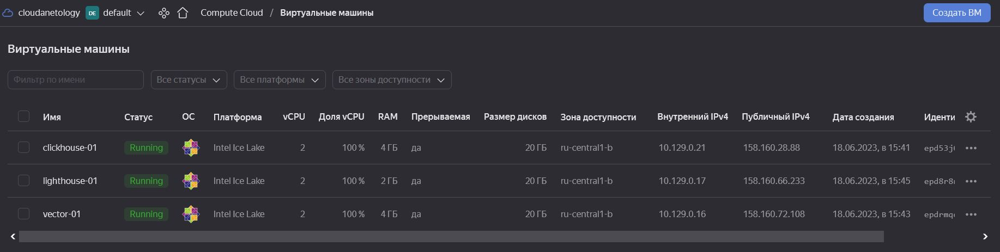

# Домашнее задание к занятию 3 «Использование Ansible»

## Подготовка к выполнению

> 1. Подготовьте в Yandex Cloud три хоста: для `clickhouse`, для `vector` и для `lighthouse`.
> 2. Репозиторий LightHouse находится [по ссылке](https://github.com/VKCOM/lighthouse).

Подготовили ВМ в облаке:
<p align="center">
  
</p>


## Основная часть

1. Допишите playbook: нужно сделать ещё один play, который устанавливает и настраивает LightHouse.
2. При создании tasks рекомендую использовать модули: `get_url`, `template`, `yum`, `apt`.
3. Tasks должны: скачать статику LightHouse, установить Nginx или любой другой веб-сервер, настроить его конфиг для открытия LightHouse, запустить веб-сервер.

>  Добавляем к существующему playbook из предыдущего задания часть, отвечающую за установку LightHouse и веб-сервера
```commandline

- name: Install Nginx
  hosts: lighthouse
  become: true
  handlers:
    - name: Start nginx
      command: nginx
    - name: Reload nginx
      command: nginx -s reload
  tasks:
    - name: Nginx | Install epel-release
      yum:
        name: epel-release
        state: present
    - name: Nginx | Install Nginx
      yum:
        name: nginx
        state: present
      notify: Start nginx
    - name: Nginx | Create Nginx config
      template:
        src: templates/nginx.conf.j2
        dest: /etc/nginx/nginx.conf
        mode: 0644
      notify: Reload nginx

- name: Install lighthouse
  hosts: lighthouse
  become: true
  handlers:
    - name: Reload nginx
      command: nginx -s reload
  pre_tasks:
    - name: Lighthouse | Install git
      yum:
        name: git
        state: present
    - name: Lighthouse | Create dir for Lighthouse
      file:
        path: "{{ lighthouse_location_dir }}"
        state: directory
  tasks:
    - name: Lighthouse | Copy lighthouse from git
      git:
        repo: "{{ lighthouse_vcs }}"
        version: master
        dest: "{{ lighthouse_location_dir }}"
    - name: Lighthouse | Create lighthouse config
      template:
        src: templates/lighthouse.conf.j2
        dest: /etc/nginx/conf.d/default.conf
        mode: 0644
      notify: Reload nginx

```
6. Подготовьте свой inventory-файл `prod.yml`.

>Inventory файл:
```commandline
---
clickhouse:
  hosts:
    clickhouse-01:
      ansible_host: 158.160.28.88
      ansible_ssh_user: vagrant
      
vector:
  hosts:
    vector-01:
      ansible_host: 158.160.72.108
      ansible_ssh_user: vagrant

lighthouse:
  hosts:
    lighthouse-01:
      ansible_host: 158.160.66.233
      ansible_ssh_user: vagrant
```
5. Запустите `ansible-lint site.yml` и исправьте ошибки, если они есть.
 
>Запускаем - ошибок для исправления нет:
```commandline
$ ansible-lint site.yml
WARNING: PATH altered to include /usr/bin
WARNING  Overriding detected file kind 'yaml' with 'playbook' for given positional argument: site.yml
WARNING  Listing 1 violation(s) that are fatal
risky-file-permissions: File permissions unset or incorrect
site.yml:109 Task/Handler: Lighthouse | Create dir for Lighthouse

You can skip specific rules or tags by adding them to your configuration file:
# .ansible-lint
warn_list:  # or 'skip_list' to silence them completely
  - experimental  # all rules tagged as experimental

Finished with 0 failure(s), 1 warning(s) on 1 files.
```
7. Попробуйте запустить playbook на этом окружении с флагом `--check`.
> В Playbook добавили игнорирование ошибок при --check выполнении в местах, где они вызваны отсутствием файлов/сервисов на хостах
```commandline
$ ansible-playbook site.yml -i inventory/prod.yml --check

PLAY [Install Clickhouse] **********************************************************************************************************************************

TASK [Gathering Facts] *************************************************************************************************************************************
ok: [clickhouse-01]

TASK [Clickhouse | Get distrib] ****************************************************************************************************************************
changed: [clickhouse-01] => (item=clickhouse-client)
changed: [clickhouse-01] => (item=clickhouse-server)
failed: [clickhouse-01] (item=clickhouse-common-static) => {"ansible_loop_var": "item", "changed": false, "dest": "./clickhouse-common-static-22.3.3.44.rpm", "elapsed": 0, "item": "clickhouse-common-static", "msg": "Request failed", "response": "HTTP Error 404: Not Found", "status_code": 404, "url": "https://packages.clickhouse.com/rpm/stable/clickhouse-common-static-22.3.3.44.noarch.rpm"}

TASK [Clickhouse | Get distrib] ****************************************************************************************************************************
changed: [clickhouse-01]

TASK [Clickhouse | Install packages] ***********************************************************************************************************************
fatal: [clickhouse-01]: FAILED! => {"changed": false, "msg": "No RPM file matching 'clickhouse-common-static-22.3.3.44.rpm' found on system", "rc": 127, "results": ["No RPM file matching 'clickhouse-common-static-22.3.3.44.rpm' found on system"]}
...ignoring

TASK [Clickhouse | Flush handlers] *************************************************************************************************************************

TASK [Clickhouse | Wait for server start] ******************************************************************************************************************
skipping: [clickhouse-01]

TASK [Clickhouse | Create database] ************************************************************************************************************************
skipping: [clickhouse-01]

PLAY [Install Vector] **************************************************************************************************************************************

TASK [Gathering Facts] *************************************************************************************************************************************
ok: [vector-01]

TASK [Vector | Get Vector distrib] *************************************************************************************************************************
changed: [vector-01]

TASK [Vector | YUM install] ********************************************************************************************************************************
fatal: [vector-01]: FAILED! => {"changed": false, "msg": "No RPM file matching 'vector-0.21.1-1.x86_64.rpm' found on system", "rc": 127, "results": ["No RPM file matching 'vector-0.21.1-1.x86_64.rpm' found on system"]}
...ignoring

TASK [Vector | Template config] ****************************************************************************************************************************
changed: [vector-01]

TASK [Vector | Template systemd unit] **********************************************************************************************************************
changed: [vector-01]

TASK [Vector | Start service] ******************************************************************************************************************************
fatal: [vector-01]: FAILED! => {"changed": false, "msg": "Could not find the requested service vector: host"}
...ignoring

PLAY [Install Nginx] ***************************************************************************************************************************************

TASK [Gathering Facts] *************************************************************************************************************************************
ok: [lighthouse-01]

TASK [Nginx | Install epel-release] ************************************************************************************************************************
changed: [lighthouse-01]

TASK [Nginx | Install Nginx] *******************************************************************************************************************************
fatal: [lighthouse-01]: FAILED! => {"changed": false, "msg": "No package matching 'nginx' found available, installed or updated", "rc": 126, "results": ["No package matching 'nginx' found available, installed or updated"]}
...ignoring

TASK [Nginx | Create Nginx config] *************************************************************************************************************************
changed: [lighthouse-01]

RUNNING HANDLER [Reload nginx] *****************************************************************************************************************************
skipping: [lighthouse-01]

PLAY [Install lighthouse] **********************************************************************************************************************************

TASK [Gathering Facts] *************************************************************************************************************************************
ok: [lighthouse-01]

TASK [Lighthouse | Install git] ****************************************************************************************************************************
changed: [lighthouse-01]

TASK [Lighthouse | Create dir for Lighthouse] **************************************************************************************************************
changed: [lighthouse-01]

TASK [Lighthouse | Copy lighthouse from git] ***************************************************************************************************************
fatal: [lighthouse-01]: FAILED! => {"changed": false, "msg": "Failed to find required executable \"git\" in paths: /sbin:/bin:/usr/sbin:/usr/bin:/usr/local/sbin"}
...ignoring

TASK [Lighthouse | Create lighthouse config] ***************************************************************************************************************
changed: [lighthouse-01]

RUNNING HANDLER [Reload nginx] *****************************************************************************************************************************
skipping: [lighthouse-01]

PLAY RECAP *************************************************************************************************************************************************
clickhouse-01              : ok=3    changed=1    unreachable=0    failed=0    skipped=2    rescued=1    ignored=1
lighthouse-01              : ok=9    changed=5    unreachable=0    failed=0    skipped=2    rescued=0    ignored=2
vector-01                  : ok=6    changed=3    unreachable=0    failed=0    skipped=0    rescued=0    ignored=2
```
7. Запустите playbook на `prod.yml` окружении с флагом `--diff`. Убедитесь, что изменения на системе произведены.
```commandline
$ ansible-playbook site.yml -i inventory/prod.yml --diff

PLAY [Install Clickhouse] **********************************************************************************************************************************

TASK [Gathering Facts] *************************************************************************************************************************************
ok: [clickhouse-01]

TASK [Clickhouse | Get distrib] ****************************************************************************************************************************
changed: [clickhouse-01] => (item=clickhouse-client)
changed: [clickhouse-01] => (item=clickhouse-server)
failed: [clickhouse-01] (item=clickhouse-common-static) => {"ansible_loop_var": "item", "changed": false, "dest": "./clickhouse-common-static-22.3.3.44.rpm", "elapsed": 0, "item": "clickhouse-common-static", "msg": "Request failed", "response": "HTTP Error 404: Not Found", "status_code": 404, "url": "https://packages.clickhouse.com/rpm/stable/clickhouse-common-static-22.3.3.44.noarch.rpm"}

TASK [Clickhouse | Get distrib] ****************************************************************************************************************************
changed: [clickhouse-01]

TASK [Clickhouse | Install packages] ***********************************************************************************************************************
changed: [clickhouse-01]

TASK [Clickhouse | Flush handlers] *************************************************************************************************************************

RUNNING HANDLER [Start clickhouse service] *****************************************************************************************************************
changed: [clickhouse-01]

TASK [Clickhouse | Wait for server start] ******************************************************************************************************************
ok: [clickhouse-01]

TASK [Clickhouse | Create database] ************************************************************************************************************************
changed: [clickhouse-01]

PLAY [Install Vector] **************************************************************************************************************************************

TASK [Gathering Facts] *************************************************************************************************************************************
ok: [vector-01]

TASK [Vector | Get Vector distrib] *************************************************************************************************************************
changed: [vector-01]

TASK [Vector | YUM install] ********************************************************************************************************************************
changed: [vector-01]

TASK [Vector | Template config] ****************************************************************************************************************************
--- before
+++ after: /home/andrey/.ansible/tmp/ansible-local-40196jvz1i1k9/tmp6564sumf/vector.yml.j2
@@ -0,0 +1,19 @@
+---
+sinks:
+    to_clickhouse:
+        compression: gzip
+        database: logs
+        endpoint: http://10.129.0.21:8123
+        healthcheck: false
+        inputs:
+        - our_log
+        skip_unknown_fields: true
+        table: access_logs
+        type: clickhouse
+sources:
+    our_log:
+        ignore_older_secs: 600
+        include:
+        - home/vagrant/logs/1.log
+        read_from: beginning
+        type: file

changed: [vector-01]

TASK [Vector | Template systemd unit] **********************************************************************************************************************
--- before
+++ after: /home/andrey/.ansible/tmp/ansible-local-40196jvz1i1k9/tmp3asi4s59/vector.service.yml.j2
@@ -0,0 +1,12 @@
+---
+[Unit]
+Description=Vector service
+After=network.target
+Requires=network-online.target
+[Service]
+User=root
+Group=root
+ExecStart=/usr/bin/vector --config-yaml /etc/vector/vector.yml
+Restart=always
+[Install]
+WantedBy=multi-user.target
\ No newline at end of file

changed: [vector-01]

TASK [Vector | Start service] ******************************************************************************************************************************
changed: [vector-01]

PLAY [Install Nginx] ***************************************************************************************************************************************

TASK [Gathering Facts] *************************************************************************************************************************************
ok: [lighthouse-01]

TASK [Nginx | Install epel-release] ************************************************************************************************************************
changed: [lighthouse-01]

TASK [Nginx | Install Nginx] *******************************************************************************************************************************
changed: [lighthouse-01]

TASK [Nginx | Create Nginx config] *************************************************************************************************************************
--- before: /etc/nginx/nginx.conf
+++ after: /home/andrey/.ansible/tmp/ansible-local-40196jvz1i1k9/tmpicp7fius/nginx.conf.j2
@@ -1,13 +1,9 @@
-# For more information on configuration, see:
-#   * Official English Documentation: http://nginx.org/en/docs/
-#   * Official Russian Documentation: http://nginx.org/ru/docs/
+user root;
+worker_processes 1;

-user nginx;
-worker_processes auto;
 error_log /var/log/nginx/error.log;
 pid /run/nginx.pid;

-# Load dynamic modules. See /usr/share/doc/nginx/README.dynamic.
 include /usr/share/nginx/modules/*.conf;

 events {
@@ -30,55 +26,23 @@
     include             /etc/nginx/mime.types;
     default_type        application/octet-stream;

-    # Load modular configuration files from the /etc/nginx/conf.d directory.
-    # See http://nginx.org/en/docs/ngx_core_module.html#include
-    # for more information.
     include /etc/nginx/conf.d/*.conf;

     server {
-        listen       80;
+       listen       80;
         listen       [::]:80;
         server_name  _;
         root         /usr/share/nginx/html;

-        # Load configuration files for the default server block.
         include /etc/nginx/default.d/*.conf;

         error_page 404 /404.html;
         location = /404.html {
         }

-        error_page 500 502 503 504 /50x.html;
+       error_page 500 502 503 504 /50x.html;
         location = /50x.html {
         }
     }

-# Settings for a TLS enabled server.
-#
-#    server {
-#        listen       443 ssl http2;
-#        listen       [::]:443 ssl http2;
-#        server_name  _;
-#        root         /usr/share/nginx/html;
-#
-#        ssl_certificate "/etc/pki/nginx/server.crt";
-#        ssl_certificate_key "/etc/pki/nginx/private/server.key";
-#        ssl_session_cache shared:SSL:1m;
-#        ssl_session_timeout  10m;
-#        ssl_ciphers HIGH:!aNULL:!MD5;
-#        ssl_prefer_server_ciphers on;
-#
-#        # Load configuration files for the default server block.
-#        include /etc/nginx/default.d/*.conf;
-#
-#        error_page 404 /404.html;
-#            location = /40x.html {
-#        }
-#
-#        error_page 500 502 503 504 /50x.html;
-#            location = /50x.html {
-#        }
-#    }
-
 }
-

changed: [lighthouse-01]

RUNNING HANDLER [Start nginx] ******************************************************************************************************************************
changed: [lighthouse-01]

RUNNING HANDLER [Reload nginx] *****************************************************************************************************************************
changed: [lighthouse-01]

PLAY [Install lighthouse] **********************************************************************************************************************************

TASK [Gathering Facts] *************************************************************************************************************************************
ok: [lighthouse-01]

TASK [Lighthouse | Install git] ****************************************************************************************************************************
changed: [lighthouse-01]

TASK [Lighthouse | Create dir for Lighthouse] **************************************************************************************************************
--- before
+++ after
@@ -1,4 +1,4 @@
 {
     "path": "/home/vagrant/lighthouse",
-    "state": "absent"
+    "state": "directory"
 }

changed: [lighthouse-01]

TASK [Lighthouse | Copy lighthouse from git] ***************************************************************************************************************
>> Newly checked out d701335c25cd1bb9b5155711190bad8ab852c2ce
changed: [lighthouse-01]

TASK [Lighthouse | Create lighthouse config] ***************************************************************************************************************
--- before
+++ after: /home/andrey/.ansible/tmp/ansible-local-40196jvz1i1k9/tmpvbzr27ny/lighthouse.conf.j2
@@ -0,0 +1,11 @@
+server {
+    listen       80;
+    server_name  localhost
+
+    access_log  /var/log/nginx lighthouse_access.log  main;
+
+    location / {
+        root   /home/vagrant/lighthouse;
+        index  index.html;
+    }
+}
\ No newline at end of file

changed: [lighthouse-01]

RUNNING HANDLER [Reload nginx] *****************************************************************************************************************************
changed: [lighthouse-01]

PLAY RECAP *************************************************************************************************************************************************
clickhouse-01              : ok=6    changed=4    unreachable=0    failed=0    skipped=0    rescued=1    ignored=0
lighthouse-01              : ok=12   changed=10   unreachable=0    failed=0    skipped=0    rescued=0    ignored=0
vector-01                  : ok=6    changed=5    unreachable=0    failed=0    skipped=0    rescued=0    ignored=0
```
8. Повторно запустите playbook с флагом `--diff` и убедитесь, что playbook идемпотентен.
```commandline
$ ansible-playbook site.yml -i inventory/prod.yml --diff

PLAY [Install Clickhouse] **********************************************************************************************************************************

TASK [Gathering Facts] *************************************************************************************************************************************
ok: [clickhouse-01]

TASK [Clickhouse | Get distrib] ****************************************************************************************************************************
ok: [clickhouse-01] => (item=clickhouse-client)
ok: [clickhouse-01] => (item=clickhouse-server)
failed: [clickhouse-01] (item=clickhouse-common-static) => {"ansible_loop_var": "item", "changed": false, "dest": "./clickhouse-common-static-22.3.3.44.rpm", "elapsed": 0, "gid": 0, "group": "root", "item": "clickhouse-common-static", "mode": "0644", "msg": "Request failed", "owner": "root", "response": "HTTP Error 404: Not Found", "secontext": "unconfined_u:object_r:user_home_t:s0", "size": 246310036, "state": "file", "status_code": 404, "uid": 0, "url": "https://packages.clickhouse.com/rpm/stable/clickhouse-common-static-22.3.3.44.noarch.rpm"}

TASK [Clickhouse | Get distrib] ****************************************************************************************************************************
ok: [clickhouse-01]

TASK [Clickhouse | Install packages] ***********************************************************************************************************************
ok: [clickhouse-01]

TASK [Clickhouse | Flush handlers] *************************************************************************************************************************

TASK [Clickhouse | Wait for server start] ******************************************************************************************************************
ok: [clickhouse-01]

TASK [Clickhouse | Create database] ************************************************************************************************************************
ok: [clickhouse-01]

PLAY [Install Vector] **************************************************************************************************************************************

TASK [Gathering Facts] *************************************************************************************************************************************
ok: [vector-01]

TASK [Vector | Get Vector distrib] *************************************************************************************************************************
ok: [vector-01]

TASK [Vector | YUM install] ********************************************************************************************************************************
ok: [vector-01]

TASK [Vector | Template config] ****************************************************************************************************************************
ok: [vector-01]

TASK [Vector | Template systemd unit] **********************************************************************************************************************
ok: [vector-01]

TASK [Vector | Start service] ******************************************************************************************************************************
ok: [vector-01]

PLAY [Install Nginx] ***************************************************************************************************************************************

TASK [Gathering Facts] *************************************************************************************************************************************
ok: [lighthouse-01]

TASK [Nginx | Install epel-release] ************************************************************************************************************************
ok: [lighthouse-01]

TASK [Nginx | Install Nginx] *******************************************************************************************************************************
ok: [lighthouse-01]

TASK [Nginx | Create Nginx config] *************************************************************************************************************************
ok: [lighthouse-01]

PLAY [Install lighthouse] **********************************************************************************************************************************

TASK [Gathering Facts] *************************************************************************************************************************************
ok: [lighthouse-01]

TASK [Lighthouse | Install git] ****************************************************************************************************************************
ok: [lighthouse-01]

TASK [Lighthouse | Create dir for Lighthouse] **************************************************************************************************************
ok: [lighthouse-01]

TASK [Lighthouse | Copy lighthouse from git] ***************************************************************************************************************
ok: [lighthouse-01]

TASK [Lighthouse | Create lighthouse config] ***************************************************************************************************************
ok: [lighthouse-01]

PLAY RECAP *************************************************************************************************************************************************
clickhouse-01              : ok=5    changed=0    unreachable=0    failed=0    skipped=0    rescued=1    ignored=0
lighthouse-01              : ok=9    changed=0    unreachable=0    failed=0    skipped=0    rescued=0    ignored=0
vector-01                  : ok=6    changed=0    unreachable=0    failed=0    skipped=0    rescued=0    ignored=0

```
9. Подготовьте README.md-файл по своему playbook. В нём должно быть описано: что делает playbook, какие у него есть параметры и теги.
>[Playbook_README.md](./playbook/README.md)
11. Готовый playbook выложите в свой репозиторий, поставьте тег `08-ansible-03-yandex` на фиксирующий коммит, в ответ предоставьте ссылку на него.
